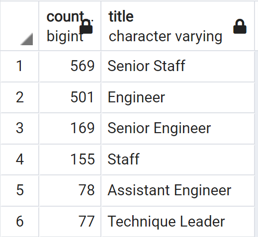

# Pewlett-Hackard-Analysis

## Overview of the analysis
Pewlett-Hackard Analysis project uses SQL techniques to design and manage employee database. The Entity Relationship Diagram helps us to create multiple tables, perform data modeling, and complete employment analysis for Pewlett-Hackard Company. Our purpose is to determine the number of retiring employees per title, and identify employees to eligible for Mentorship Program.

## Results
We create unique_titles table for employees who has the most recent title. It shows Pewlett_Hackard Company has *72,458* employees are born on *1952* to *1955*, which means these amount of employees reach retirement-age by most recent job title. After we filter by all active employees in this company, we also found there are 1,549 employees are eligible for the Mentorship Program.
  - Retiring Employees Results:
    - Total retiring employees: 72,458.
    - Senior Level of employees has 70% of total retiring amount.
    - Only 2 Managers reach retirement-age.
    - There are 7 roles for retiring empoyees in this company.
    
  **Retiring employees by titles**:

  - Mentorship Eligibility Results:
    - Total 1,548 employees qualify Mentorship Program.
    - There are 6 roles in general eligibility results.
    - Senior Staff and Engineer has the most majority of the total qualification.
    - Assistant Engineer and Technique Leader had the minority of the qualifacation.

## Summary 
As we analyze the employee data, there are 7 roles will need to be filled as the "silver tsunami" begins to make an impact.In addition, Pewlett-Hackard Company has not enough empoyees to qualified, who retirement-ready employees in the departments to mentor the next generation. Especially in the Managerment role, employees who have the manager titles not even show on the mentorship list. 
  
  **Insight for mentorship by title:**
 

**Resources for additional insights:**
1. https://github.com/FIRE-Phoebe/Pewlett-Hackard-Analysis/blob/fa1b4474a2396244b21b2f187db4e9c5c283a9cc/queries/mentorship_by_titles.sql
2. https://github.com/FIRE-Phoebe/Pewlett-Hackard-Analysis/blob/fa1b4474a2396244b21b2f187db4e9c5c283a9cc/queries/Compare_retiring_mentorship.sql
